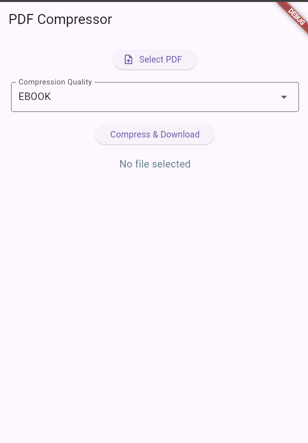

# PDF Compressor - Flutter & Flask Full-Stack Project

<p align="center">
  
  
  
  
  
</p>

A complete, cross-platform PDF compression tool featuring a **Flutter** frontend and a **Flask** backend. This project is designed to solve a common problem for students and professionals: reducing large PDF file sizes without relying on slow, ad-filled online services.

The Flutter app provides a clean, native experience on mobile and desktop, while the Flask server handles the heavy lifting of PDF compression using the powerful **Ghostscript** engine.

---

## 📸 Demo of Running Application

<p align="center">
  
  <br>
  <em>The main interface of the PDF Compressor app in action.</em>
</p>

---

## ✨ Why This Project?

-   **Student-Focused:** Built to help students meet assignment upload size limits on university portals.
-   **Cross-Platform:** The Flutter app is designed to run seamlessly on Android, iOS, Windows, macOS, and Linux.
-   **Self-Hosted & Private:** The backend can be run locally. Your files never leave your machine, ensuring privacy.
-   **Quality Control:** Offers multiple compression presets to balance file size and visual quality.

---

## 🚀 Features

- 📂 **File Selection:** Pick any PDF file from your device.
- ⚙️ **Multiple Compression Levels:**
    -   `screen`: Low resolution, maximum compression.
    -   `ebook`: Balanced quality for on-screen reading.
    -   `printer`: High quality, suitable for printing.
    -   `prepress`: Highest quality for professional use.
- 📥 **One-Tap Operation:** Compress and download the resulting file with a single button press.
- 💾 **Save As Dialog:** Choose the name and location for your saved file.

---

## 📁 Project Structure

The repository is organized into two main parts: the `frontend` (Flutter app) and the `backend` (Flask server).

```
PDF_Compressor/
├── backend/        # Flask server for PDF compression
│   ├── main.py
│   ├── requirements.txt
│   └── README.md
├── frontend/       # Flutter app for all platforms
│   ├── lib/main.dart
│   ├── pubspec.yaml
│   └── README.md
├── .github/assets/ # Contains assets like images for the README
└── README.md       # You are here!
```

---

## 🛠️ Tech Stack

| Layer              | Technology      |
| ------------------ | --------------- |
| **Frontend**       | Flutter (Dart)  |
| **Backend**        | Flask (Python)  |
| **Compression**    | Ghostscript     |

---

## ⚡ Getting Started

Follow these steps to get the project running on your local machine.

### 1. Backend Setup (Flask Server)

> 📌 **Full instructions are in the `backend/README.md` file.**

1.  **Prerequisites:** Ensure you have Python 3, pip, and Ghostscript installed and added to your system's PATH.
2.  **Navigate & Install:**
    ```bash
    cd backend
    pip install -r requirements.txt
    ```
3.  **Run the Server:**
    ```bash
    python app.py
    ```
    The server will start, typically at `http://127.0.0.1:5000`.

### 2. Frontend Setup (Flutter App)

> 📱 **Full instructions are in the `frontend/README.md` file.**

1.  **Prerequisites:** Ensure you have the Flutter SDK installed.
2.  **Navigate & Install Dependencies:**
    ```bash
    cd frontend
    flutter pub get
    ```
3.  **Configure API Endpoint:**
    Open `frontend/lib/main.dart` and update the `_uploadUrl` to match your running Flask server's address.
    ```dart
    // Example for a local server
    const String _uploadUrl = 'http://127.0.0.1:5000/upload';
    ```
4.  **Run the App:**
    ```bash
    flutter run
    ```

## 🛠 Tech Stack

| Layer     | Technology         |
|-----------|--------------------|
| Frontend  | Flutter (Dart)     |
| Backend   | Flask (Python)     |
| Compression Engine | Ghostscript  |


---


## 📖 How to Use

Once the backend server is running and the Flutter app is launched:

1.  **Select a PDF:** Tap the "Select PDF" button to open your device's file picker.
2.  **Choose Quality:** Use the dropdown menu to select the desired compression level.
3.  **Compress:** Tap the "Compress & Download" button.
4.  **Save File:** A "Save As" dialog will appear, allowing you to name the file and choose where to save it.

---

## 📚 In-Depth Documentation

For more specific details on each component, please refer to their individual README files:

-   **Backend Details:** `backend/README.md`
-   **Frontend Details:** `frontend/README.md`

---

## 🤝 Contributing

Contributions are what make the open-source community such an amazing place to learn, inspire, and create. Any contributions you make are **greatly appreciated**.

Please feel free to fork the repository and submit a pull request. You can also open an issue with the tag "enhancement" to suggest new features.

---

## 👨‍💻 Author

Made with 💙 by M-Salman-khan

---

## 📜 License

This project is distributed under the MIT License. See `LICENSE` for more information.

---

## 🌟 Show Your Support

If this project helped you, please give it a ⭐️ on GitHub! This helps others find it and encourages future development.
